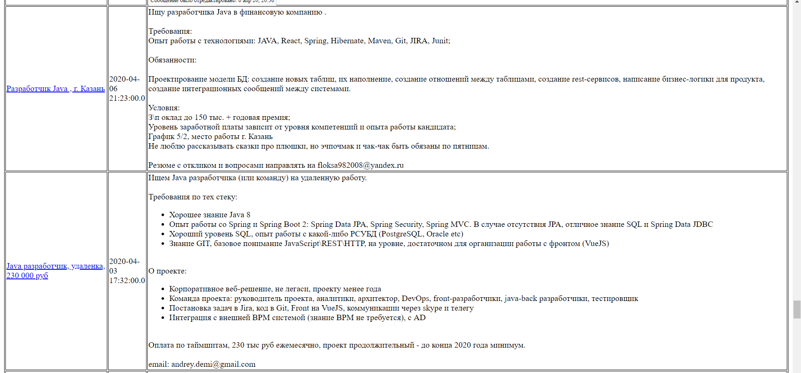

# job4j_grabber

This project represents basic HTML grabber.

#### Functionality:
- Grabbing programmer vacancies from sql.ru
- CRUD operations for vacancies
- Loading the HTML page with vacancies using simple HTTP Server 

#### Used technologies:
- JSOUP for parsing
- JDBC for manipulating with DB
- Quartz library for scheduling 
- Slf4j for logging

